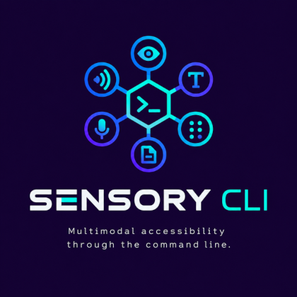

# Sensory CLI

<p align="center">
  
</p>

<p align="center">
  <strong>Multimodal accessibility through the command line.</strong>
</p>

<p align="center">
  A command-line toolkit designed to make digital information more accessible through vision, text, speech, audio, and Braille.
</p>

<p align="center">
  <a href="#features">Features</a> •
  <a href="#installation">Installation</a> •
  <a href="#usage">Usage</a> •
  <a href="#development">Development</a> •
  <a href="#architecture">Architecture</a> •
  <a href="#roadmap">Roadmap</a> •
  <a href="#contributing">Contributing</a>
</p>

---

## About

**Sensory CLI** is an open-source command-line accessibility toolkit focused on transforming digital information between different modalities.

The project brings accessibility-oriented capabilities directly to the terminal, allowing users to process images, documents, text, audio, and other forms of digital content without depending on a graphical interface.

The long-term goal is to create a modular accessibility toolkit capable of connecting different perception and output technologies through a unified command-line interface.

```text
                     ┌─────────────────┐
                     │   SENSORY CLI   │
                     └────────┬────────┘
                              │
              ┌───────────────┼───────────────┐
              │               │               │
           Vision            Text            Audio
              │               │               │
          ┌───┴───┐       ┌───┴───┐       ┌───┴───┐
          │       │       │       │       │       │
        Image    OCR   Translate Summ.   STT     TTS
              │               │               │
              └───────────────┼───────────────┘
                              │
                    ┌─────────┴─────────┐
                    │ Accessibility     │
                    │      Output       │
                    └─────────┬─────────┘
                              │
                 ┌────────────┼────────────┐
                 │            │            │
               Text         Audio       Braille
```

---

## Features

Sensory CLI is designed around a modular set of accessibility capabilities.

### Vision

Process and interpret visual information.

* Image description
* Image analysis
* Object recognition
* Visual content extraction
* Color and visual attribute detection

### OCR

Extract text from images and scanned documents.

* Optical Character Recognition
* Text extraction from photographs
* Scanned document processing
* Integration with image-processing pipelines

### Speech Recognition

Convert spoken language into text.

* Audio transcription
* Speech-to-text
* Microphone input
* Audio file processing

### Text-to-Speech

Convert textual information into spoken output.

* Text-to-speech
* Document reading
* Command output narration
* Configurable voices and languages

### Braille

Provide Braille-oriented text processing and output.

* Text-to-Braille translation
* Braille-ready output
* Integration with Braille displays
* Support for future tactile hardware

### Documents

Make digital documents easier to access.

* PDF text extraction
* OCR-based document processing
* Document summarization
* Text-to-speech reading
* Structured content extraction

### Language

Assist with multilingual accessibility.

* Translation
* Language detection
* Text normalization
* Multilingual speech processing

### AI Assistance

Provide higher-level interpretation of accessible content.

* Content summarization
* Image understanding
* Contextual descriptions
* Natural-language interaction
* Question answering over documents

---

# Installation

Sensory CLI is developed in **Python** and uses **uv** for Python environment and dependency management.

## Requirements

Before installing Sensory CLI, make sure you have:

* Python 3.11 or newer
* [uv](https://docs.astral.sh/uv/)
* Git

Check your environment:

```bash
python --version
uv --version
git --version
```

## Clone the repository

```bash
git clone https://github.com/igorcrissaff/sensory-cli.git
cd sensory-cli
```

## Install dependencies

Create the project's virtual environment and install its dependencies with:

```bash
uv sync
```

`uv` automatically creates and manages the project's virtual environment.

## Run the CLI

During development, the CLI can be executed with:

```bash
uv run sensory --help
```

or:

```bash
uv run sensory
```

---

# Usage

After installation, Sensory CLI is designed to be used through the `sensory` command.

```bash
sensory <command> [options]
```

To see all available commands:

```bash
sensory --help
```

For help with a specific command:

```bash
sensory <command> --help
```

> The commands below represent the planned interface and may change as the project evolves.

---

## Image Description

Describe an image using the vision module:

```bash
sensory describe image.jpg
```

During development:

```bash
uv run sensory describe image.jpg
```

Example:

```text
◉ Vision

Analyzing image...
✓ Image processed

Description:
A person sitting at a desk using a laptop.
```

---

## OCR

Extract text from an image:

```bash
sensory ocr document.png
```

Example:

```text
[T] OCR

Processing image...
✓ Text extracted

Hello, world!
```

Save the extracted text to a file:

```bash
sensory ocr document.png > output.txt
```

---

## Speech-to-Text

Transcribe an audio file:

```bash
sensory transcribe recording.wav
```

Example:

```text
))) Speech Recognition

Processing audio...
✓ Transcription complete

"Welcome to Sensory CLI."
```

---

## Text-to-Speech

Convert text into speech:

```bash
sensory speak "Welcome to Sensory CLI."
```

Text can also be read from a file:

```bash
sensory speak --file document.txt
```

---

## Braille

Translate text into Braille:

```bash
sensory braille "Hello, world!"
```

Example:

```text
⠓⠑⠇⠇⠕⠂⠀⠺⠕⠕⠗⠇⠙⠖
```

A future version may support direct communication with refreshable Braille displays:

```bash
sensory braille output document.txt --device <device>
```

---

## Read Documents

Process and read a document:

```bash
sensory read document.pdf
```

The document processing pipeline may combine multiple accessibility capabilities:

```text
PDF
 │
 ▼
Text Extraction
 │
 ├──► Terminal
 │
 ├──► OCR
 │
 ├──► Summarization
 │
 ├──► Text-to-Speech
 │
 └──► Braille
```

---

## Translation

Translate text between languages:

```bash
sensory translate "Hello, world!" --to pt-BR
```

For files:

```bash
sensory translate document.txt --to pt-BR
```

---

# Development

Sensory CLI uses **uv** as its primary development and dependency management tool.

## Create the development environment

After cloning the repository:

```bash
uv sync
```

Activate the virtual environment if you want to work directly inside it:

### Linux/macOS

```bash
source .venv/bin/activate
```

### Windows PowerShell

```powershell
.venv\Scripts\Activate.ps1
```

Alternatively, you can avoid activating the environment and use:

```bash
uv run <command>
```

For example:

```bash
uv run python --version
```

---

## Add a dependency

Add a runtime dependency:

```bash
uv add package-name
```

For a development dependency:

```bash
uv add --dev package-name
```

For example:

```bash
uv add requests
```

or:

```bash
uv add --dev pytest
```

Remove a dependency with:

```bash
uv remove package-name
```

After modifying dependencies:

```bash
uv sync
```

---

## Run tests

Tests can be executed with:

```bash
uv run pytest
```

For more detailed output:

```bash
uv run pytest -v
```

---

## Code quality

When configured in the project, formatting and linting can be executed through:

```bash
uv run ruff format .
```

```bash
uv run ruff check .
```

These tools help maintain a consistent and reliable codebase.

---

# Configuration

Sensory CLI is intended to support configuration through environment variables and/or a configuration file.

A future configuration may look like:

```env
SENSORY_LANGUAGE=en-US

SENSORY_OCR_ENGINE=tesseract
SENSORY_SPEECH_ENGINE=local
SENSORY_TTS_ENGINE=local

SENSORY_AI_PROVIDER=local
```

Sensitive credentials should never be committed to the repository.

Use an environment file for local development when necessary:

```text
.env
```

and keep it outside version control:

```text
.gitignore
```

---

# Command Structure

Sensory CLI is intended to remain simple for common operations while allowing more advanced functionality through subcommands.

```text
sensory
├── vision
│   ├── describe
│   ├── analyze
│   └── objects
│
├── text
│   ├── ocr
│   ├── translate
│   └── summarize
│
├── audio
│   ├── transcribe
│   └── speak
│
├── braille
│   ├── translate
│   └── output
│
└── document
    ├── read
    ├── extract
    └── summarize
```

The project can also expose frequently used operations as short top-level commands:

```bash
sensory ocr image.png
sensory describe image.jpg
sensory transcribe audio.wav
sensory speak "Hello"
sensory braille "Hello"
```

This allows the interface to remain convenient for both interactive use and automation.

---

# Architecture

Sensory CLI is designed around a modular architecture.

```text
                         ┌───────────────┐
                         │  Sensory CLI  │
                         └───────┬───────┘
                                 │
                         ┌───────▼───────┐
                         │  Command      │
                         │  Interface     │
                         └───────┬───────┘
                                 │
                         ┌───────▼───────┐
                         │ Sensory Core  │
                         └───────┬───────┘
                                 │
             ┌───────────────────┼───────────────────┐
             │                   │                   │
       ┌─────▼─────┐       ┌─────▼─────┐       ┌─────▼─────┐
       │   Vision  │       │    Text   │       │   Audio   │
       └─────┬─────┘       └─────┬─────┘       └─────┬─────┘
             │                   │                   │
       ┌─────▼─────┐       ┌─────▼─────┐       ┌─────▼─────┐
       │ Image     │       │ OCR       │       │ STT       │
       │ Analysis  │       │ Translate │       │ TTS       │
       │ Detection │       │ Summarize │       │ Processing│
       └───────────┘       └───────────┘       └───────────┘
                                 │
                         ┌───────▼───────┐
                         │ Accessibility │
                         │    Outputs    │
                         └───────┬───────┘
                                 │
                    ┌────────────┼────────────┐
                    │            │            │
                   Text        Audio        Braille
```

The modular approach allows individual components to be replaced or extended without redesigning the entire application.

---

# Project Structure

The project is organized around independent modules:

```text
sensory-cli/
│
├── sensory/
│   ├── cli/
│   ├── core/
│   ├── vision/
│   ├── text/
│   ├── audio/
│   ├── braille/
│   ├── documents/
│   └── accessibility/
│
├── tests/
│
├── docs/
│
├── examples/
│
├── assets/
│   └── logo.png
│
├── pyproject.toml
├── uv.lock
├── README.md
├── LICENSE
└── CONTRIBUTING.md
```

The structure may evolve as new capabilities are introduced.

---

# Accessibility Outputs

A central concept of Sensory CLI is that information should not be restricted to a single output format.

The same input can potentially be transformed into different accessible representations:

```text
              INPUT
                │
       ┌────────┼────────┐
       │        │        │
      Image    Audio    Document
       │        │        │
       └────────┼────────┘
                │
          SENSORY CORE
                │
       ┌────────┼────────┐
       │        │        │
      Text     Audio    Braille
```

For example:

```bash
sensory describe image.jpg --output text
sensory describe image.jpg --output speech
sensory ocr document.png --output braille
```

This abstraction is intended to make the toolkit useful across different accessibility requirements and hardware environments.

---

# Automation

Because Sensory CLI is a command-line application, its operations can be combined with existing shell tools and scripts.

For example:

```bash
sensory ocr document.png > output.txt
```

Process the output:

```bash
sensory ocr document.png | sensory summarize
```

Convert extracted content to speech:

```bash
sensory ocr document.png | sensory speak
```

Or create a complete accessibility pipeline:

```text
Image
  │
  ▼
 OCR
  │
  ▼
 Text
  │
  ├──────► Terminal
  │
  ├──────► Summary
  │
  ├──────► Speech
  │
  └──────► Braille
```

This composability is one of the core advantages of the CLI approach.

---

# Planned Integrations

Potential integrations include:

* OCR engines
* Computer vision models
* Speech recognition engines
* Text-to-speech engines
* Machine translation systems
* Large language models
* Braille translation libraries
* Refreshable Braille displays
* Screen readers
* Assistive hardware
* Accessibility APIs

The project will prioritize open and interoperable technologies whenever possible.

---

# Privacy

Accessibility tools frequently process sensitive information such as documents, images, conversations, and audio recordings.

Sensory CLI aims to make processing behavior explicit and give users control over where their data is processed.

Whenever external services or cloud-based AI models are used, the project should clearly identify:

* What data is transmitted
* Which service receives the data
* Whether data is stored
* Which credentials are required
* Whether local alternatives are available

Privacy is considered an important part of accessibility.

---

# Roadmap

## Phase 1 — Core CLI

* [ ] CLI architecture
* [ ] Command system
* [ ] Configuration management
* [ ] Logging
* [ ] Plugin/module system
* [ ] Basic accessibility output abstraction

## Phase 2 — Text and OCR

* [ ] OCR integration
* [ ] Text extraction
* [ ] Text normalization
* [ ] Document processing

## Phase 3 — Audio

* [ ] Speech-to-text
* [ ] Text-to-speech
* [ ] Audio file processing
* [ ] Microphone input

## Phase 4 — Vision

* [ ] Image description
* [ ] Object recognition
* [ ] Visual attribute extraction
* [ ] Contextual image analysis

## Phase 5 — Braille

* [ ] Braille translation
* [ ] Braille output
* [ ] Braille display abstraction
* [ ] Hardware integration

## Phase 6 — Intelligent Accessibility

* [ ] Document summarization
* [ ] Multimodal AI
* [ ] Context-aware descriptions
* [ ] Natural-language interaction
* [ ] Workflow automation

---

# Contributing

Contributions are welcome.

You can contribute by:

* Implementing new accessibility modules
* Improving existing integrations
* Adding tests
* Improving documentation
* Reporting bugs
* Suggesting accessibility improvements
* Developing hardware integrations
* Improving CLI usability

Before submitting a contribution, make sure the project environment is synchronized:

```bash
uv sync
```

Run the test suite:

```bash
uv run pytest
```

And, when configured:

```bash
uv run ruff check .
uv run ruff format .
```

A good contribution should preserve the project's modular architecture and accessibility-first principles.

---

# License

This project is licensed under the **MIT License**.

See the [`LICENSE`](LICENSE) file for more information.

---

# Vision

Sensory CLI aims to make the command line more than a developer interface.

It aims to make it an **accessible interface for interacting with digital information**.

```text
       SEE        HEAR       READ
        │          │          │
        └──────────┼──────────┘
                   │
              ┌────▼────┐
              │ SENSORY │
              │   CLI   │
              └────┬────┘
                   │
          ┌────────┼────────┐
          │        │        │
        TEXT      AUDIO    BRAILLE
```

> **Sensory CLI — Multimodal accessibility through the command line.**
